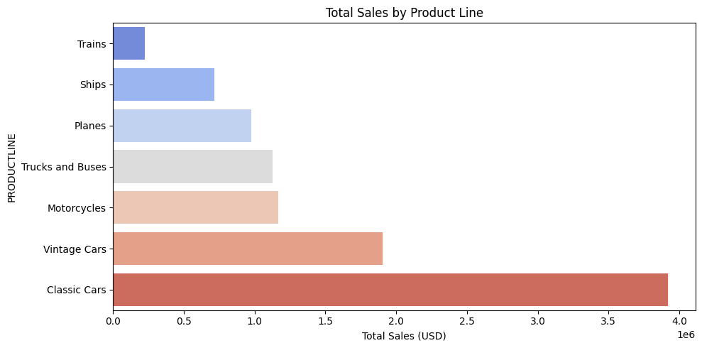
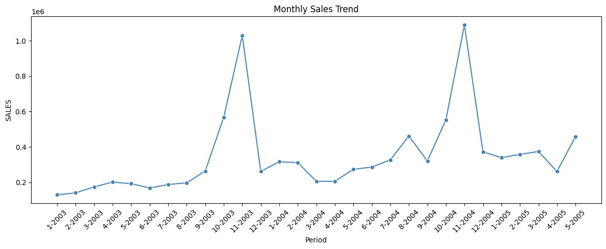
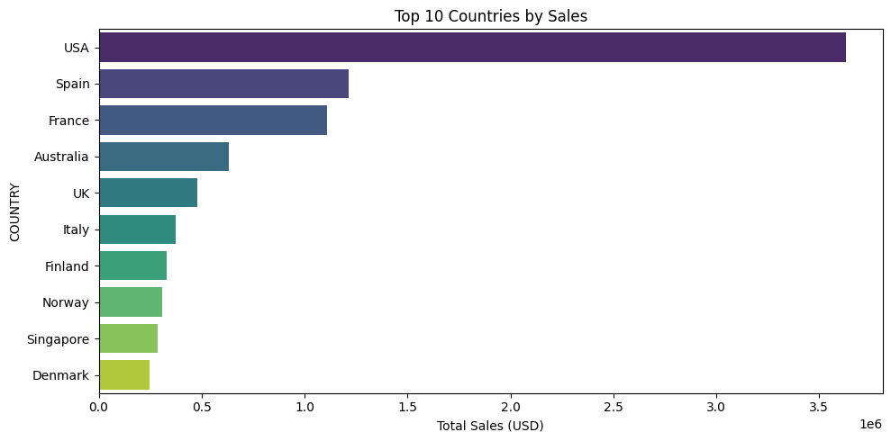
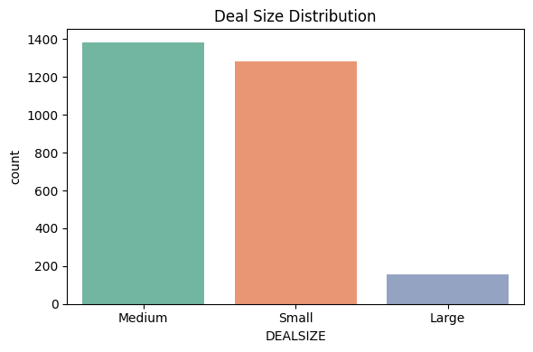

# 📊 Sales Data Analysis — EDA Project

## 🔍 Overview
Exploratory Data Analysis on a global sales dataset to uncover revenue trends,
top-performing products, and key markets.

## 🛠️ Tools Used
- Python | Pandas | Matplotlib | Seaborn | Jupyter Notebook

---

## 📈 Key Insights
- **Classic Cars** is the top-selling product line
- **USA** leads in total revenue among all countries
- Sales peak in **Q4 (October–November)**
- **Medium deal sizes** are the most frequent order type

---

## 📊 Visualizations

### 1. Total Sales by Product Line

*Displays the total sales generated by each product line. **Classic Cars** dominates the sales volume, followed by **Vintage Cars**, while **Trains** generate the least amount of sales.*

### 2. Monthly Sales Trend

*Visualizes the monthly sales trajectory. Revenue experiences significant seasonal surges during **Q4 (October and November)**, while sales drop sharply at the end of the year and during the first quarter.*

### 3. Top 10 Countries by Sales

*Shows the revenue share of the top ten purchasing countries. The **USA** leads by a massive margin, with **Spain** and **France** securing the second and third positions.*

### 4. Deal Size Distribution
 
*Represents the count of orders grouped by transaction size. **Medium-sized deals** are the most frequent order type, followed closely by **Small** deals, while **Large** deals are relatively rare.*

---

## 📁 Files
| File | Description |
|------|-------------|
| `Sales_EDA.ipynb` | Main Jupyter Notebook |
| `sales_data_sample.csv` | Raw dataset |
| `Sales_By_Product_Line.png` | Product line chart |
| `Monthly_Sales_Trend.png` | Monthly trend chart |
| `Top_10_Countries_by_Sales.png` | Country-wise sales chart |
| `Deal_Size_Distribution.png` | Deal size distribution |

---

## 🚀 How to Run
```bash
pip install -r requirements.txt
jupyter notebook Sales_EDA.ipynb
```

---

## 👤 Author
Devendra Kota Subhash Unnamatla | B.Tech CSE | [LinkedIn](https://www.linkedin.com/in/devendra-6b267a258/) | [GitHub](https://github.com/subhash068/)
